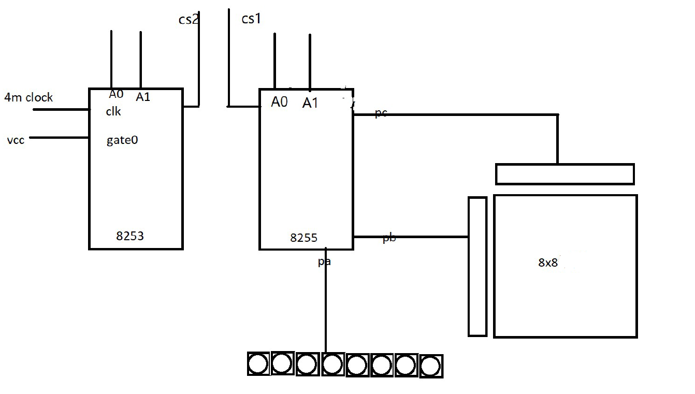

# Snake

This is a simple snake game written in assembly language running on an 8086 microprocessor.

## Diagram

## Video

## Features
- The game is written in assembly language
- The game runs on an 8086 microprocessor.
- Used the visual persistence of LED matrices to display snake and food
- Used an 8253 chip as a random number generator to generate food location
- The game has three levels: easy, medium and difficult, affecting the speed of the snake
- Snake eats enough food to proceed to the next level

## Usefull links

- [Assembly language](https://en.wikipedia.org/wiki/Assembly_language)
- [8086](https://en.wikipedia.org/wiki/Intel_8086)
- [8253](https://en.wikipedia.org/wiki/Intel_8253)
- [Visual persistence](https://en.wikipedia.org/wiki/Persistence_of_vision)